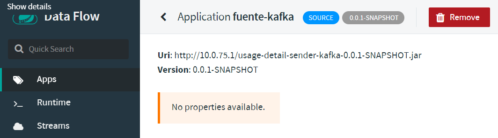
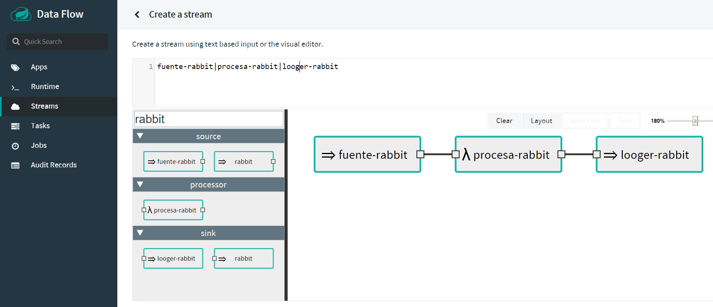
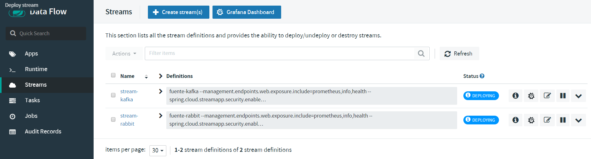
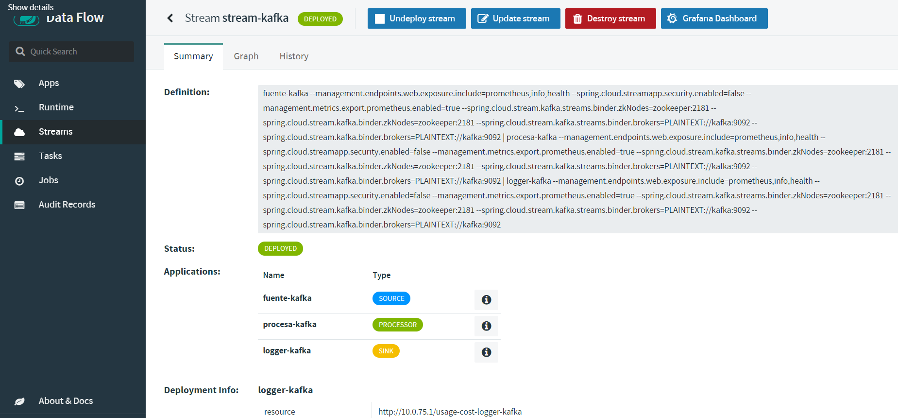
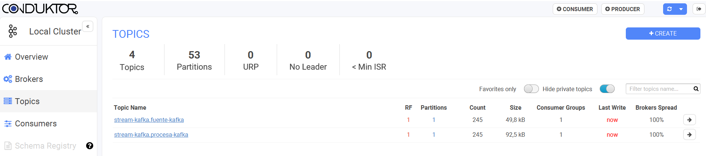
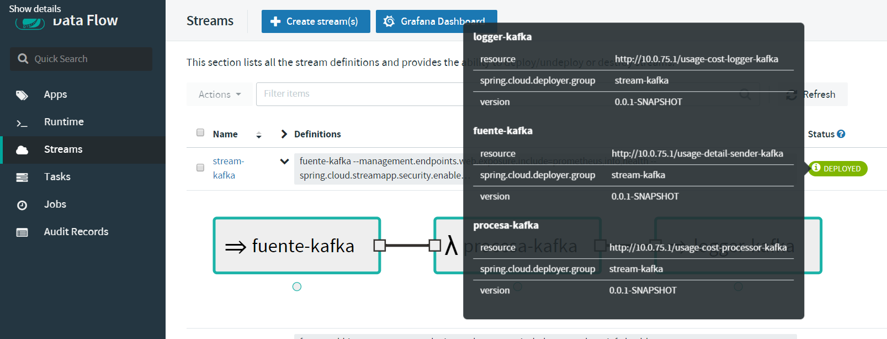
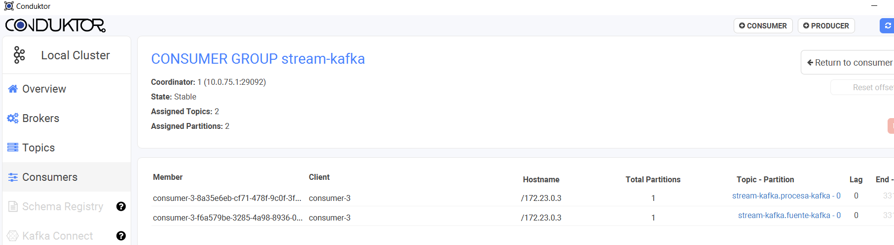

# Introduction

Para ejecutar las aplicaciones con el "paraguas" de Spring Dataflow tenemos que tomar una serie de pasos:

- Registrar las aplicaciones
- Crear el Stream
- Desplegar

## Dashboard

The Dataflow dashboard is found [here](http://localhost:9393/dashboard).

## Registrar las aplicaciones

Las aplicaciones tienen que registrarse previamente a ser utilizadas - en el dashboard. Una vez registradas podremos utilizarlas en pipelines usando el Data Flow DSL. 

El proceso de registro necesita de dos cosas:

1. Especificar el tipo de recursos
2. Indicar donde poder encontrar el recurso. El recurso se proporciona por medio de una `URI`

La `URI` representa el artefacto - maven jar, una imagen de docker, o simplemente donde un recurso http(s) o ruta a un archivo. Notese que si elegimos archivo, tiene que estar accesible desde Docker. 

```sh
file:///opt/usage-cost-logger-kafka-0.0.1-SNAPSHOT.jar
```

En nuestro caso usaremos el registro via `http`

```sh
http://10.0.75.1/usage-cost-logger-kafka-0.0.1-SNAPSHOT.jar
http://10.0.75.1/usage-cost-logger-rabbit-0.0.1-SNAPSHOT.jar
http://10.0.75.1/usage-cost-processor-kafka-0.0.1-SNAPSHOT.jar
http://10.0.75.1/usage-cost-processor-rabbit-0.0.1-SNAPSHOT.jar
http://10.0.75.1/usage-detail-sender-kafka-0.0.1-SNAPSHOT.jar
http://10.0.75.1/usage-detail-sender-rabbit-0.0.1-SNAPSHOT.jar
```


Para comprobar que las aplicaciones son accesibles, podemos ver sus detalles en el propio dashboard. Si la ruta que elegimos no estuviera accesible, se arrojaria un error. En este caso todo esta bien:



## Crear el Stream

Una vez creadas las aplicaciones podemos combinarlas en un stream:



## Desplegar



Al crear el stream Data Flow le ha asigando automaticamente una serie de propiedades:

- nombre de los topicos
- direcciones de los brokers de kafka
- direcciones de los znodes - de zookeeper

Y ademas ha hecho toda la configuracion de Prometheus



Podemos ver en Kafka dichos topicos:



Podemos ver que se ha definido automaticamente un consumer group asociado al stream:



Podemos ver el consumer group que se ha creado en kafka - coincide con la definicion:



Por ultimo podemos ver el dashboard de Grafana - usuario admin, admin:

	  
	  
  
