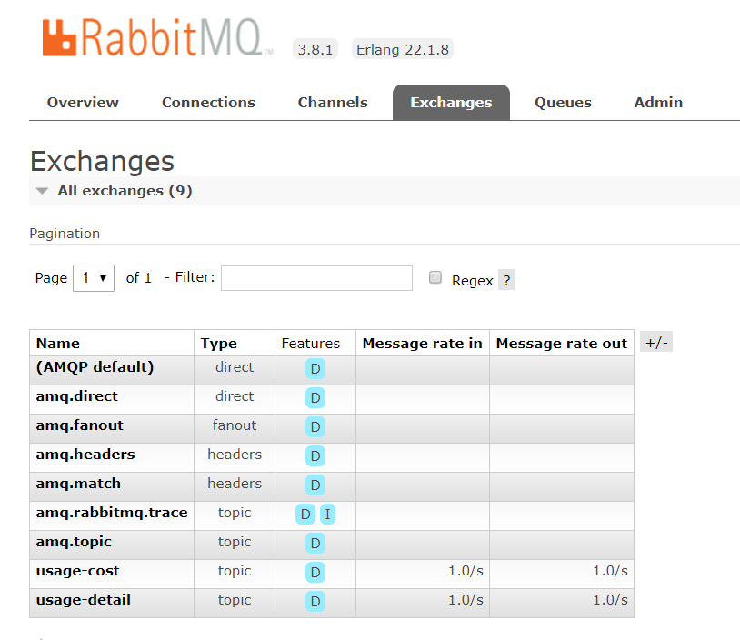
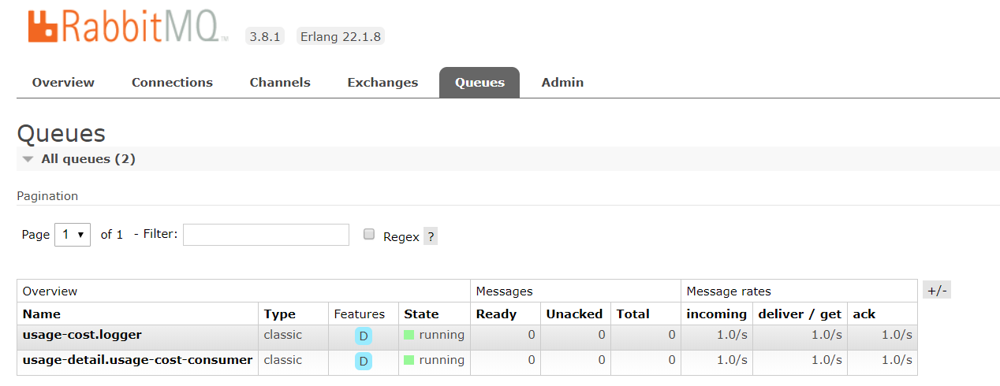
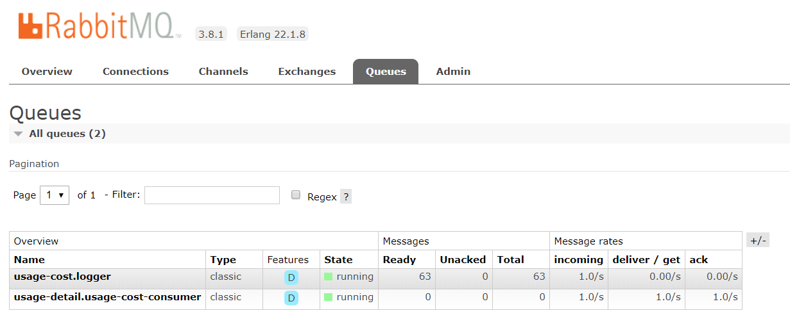

Caso equivalente al que [hemos visto con Kafka](../usage-cost-stream-kafka/readme.md)

Vamos a demostrar como utilizar Spring Streaming. Primero lo usaremos a pelo y en segundo lugar utilizando `Spring Data Flow`.

# Aplicaciones

Tenemos tres aplicaciones (como en el caso de Kafka)

- Source. Canal destino. Envia informacion
- Processor. Recibe informacion, la procesa, y la envia
- Sink. Canal fuete. Recive informacion

## Dependencias

Las tres aplicaciones usan las mismas dependencias. Las dependencias son "similares/analogas" a las usadas en Kafka:

- Usamos __Spring Stream__ (identico al caso de Kafka)

```xml
	<dependencies>
		<dependency>
			<groupId>org.springframework.cloud</groupId>
			<artifactId>spring-cloud-stream</artifactId>
		</dependency>
```

- Con el __binder de Rabbit__

```xml		
		<dependency>
			<groupId>org.springframework.boot</groupId>
			<artifactId>spring-boot-starter-amqp</artifactId>
		</dependency>
		<dependency>
			<groupId>org.springframework.cloud</groupId>
			<artifactId>spring-cloud-stream-binder-rabbit</artifactId>
		</dependency>
```

- Incluimos soporte para Controlers, y Actuator (identico al caso de Kafka)

```xml
		<dependency>
			<groupId>org.springframework.boot</groupId>
			<artifactId>spring-boot-starter-web</artifactId>
		</dependency>
		<dependency>
			<groupId>org.springframework.boot</groupId>
			<artifactId>spring-boot-starter-actuator</artifactId>
		</dependency>
```

- Para el __testing__ usamos un helper para __Spring Stream__ (identico al caso de Kafka):

```xml
		<dependency>
			<groupId>org.springframework.cloud</groupId>
			<artifactId>spring-cloud-stream-test-support</artifactId>
			<scope>test</scope>
		</dependency>
```

- Y especificamente para el __testing__ del __binder de Kafka__:

```xml		
		<dependency>
			<groupId>org.springframework.kafka</groupId>
			<artifactId>spring-kafka-test</artifactId>
			<scope>test</scope>
		</dependency>
	</dependencies>
```

## Conexion

La imagen de Rabbit incluye el [plugin de gestion](http://10.0.75.1:9080/). Las credenciales son `guest`, `guest`. Para mas detalles [ver](../Streams/Rabbit/README.md).

La conexion con el canal de Rabbit se hace en el puerto por defecto, `5672`, asi que en los application.yml no hace falta especificar nada especial.

## Aplicacion `Source`

La aplicacion se llama `usage-detail-sender-rabbit`.

El codigo es __identico__ al caso de Kafka.

### Resources

Especificamos el nombre del exchange y creamos tambien una cola persistente - asociada al exchange:

```yml
spring.cloud.stream.bindings.output.destination=usage-detail
spring.cloud.stream.bindings.output.producer.requiredGroups=usage-cost-consumer
```

Definimos un exchange llamado `usage-detail`, que tendra asociada una cola llamada `usage-cost-consumer`, y que ademas es persistente. Por defecto si no especificaramos el nombre de la cola, se crearia una cola anonima - el nombre se autogenera - y no persistente - el exchange seria persistente, pero no la cola; Los mensajes que se envien al exchange mientras el consumidor no este conectado, no llegaran al consumidor; Esto es natural, porque la cola anonima se crea cuando el consumidor se conecta al Exchange, y se borra cuando se desconecta; Si creamos la cola, la cola sera persistente, y exitira tanto si el consumidor esta conectado o no.

Otra cosa a destacar - que tambien pasa en el caso de Kafka. En la propiedad spring.cloud.stream.bindings.__output__.destination nos estamos refiriendo a un canal llamado __output__. Este es el nombre del canal que por defecto se nombra con el interface `Source.class`:

```java
public interface Source {
	String OUTPUT = "output";

	@Output(Source.OUTPUT)
	MessageChannel output();
}
```

### Testing

El codigo es __identico__ al caso de Kafka.

## Aplicacion `Procesor`

La aplicacion se llama `usage-cost-processor-rabbit`.

El codigo es __identico__ al caso de Kafka.

### Resources

Especificamos el exchange de entrada `usage-detail` y de salida `usage-cost`. Cada uno tiene asociada una cola durable. Para la entrada `usage-cost-consumer` y para la salida `logger`.

```yml
spring.cloud.stream.bindings.input.destination=usage-detail
spring.cloud.stream.bindings.input.group=usage-cost-consumer
spring.cloud.stream.bindings.output.destination=usage-cost
spring.cloud.stream.bindings.output.producer.requiredGroups=logger
```

### Testing

El codigo es __identico__ al caso de Kafka.

## Aplicacion `Sink`

La aplicacion se llama `usage-cost-logger-rabbit`.

El codigo es __identico__ al caso de Kafka.

### Resources

Especificamos el nombre del exchange ``  y de la cola `` que deben ser leidas.

```yml
spring.cloud.stream.bindings.input.destination=usage-cost
spring.cloud.stream.bindings.input.group=logger
```

### Testing

El codigo es __identico__ al caso de Kafka.

# Ejecutar las aplicaciones

Vamos a ver dos formas de ejecutar las aplicaciones:

- Directamente, como aplicaciones individuales
- Usando Spring Dataflow

En ambos casos arrancamos nuestra configuracion de docker-compose:

```sh
docker-compose up -d
```

## Directamente

Lanzamos los tres aplicaciones y nos conectamos en la [consola de RabittMQ](http://10.0.75.1:9080/).

Podemos observar como se han creado los Exchanges:



Podemos ver tambien las colas creadas:



Si paramos el consumidor de una de las colas, podemos ver como los mensajes empezaran a acumularse:



## Usando Spring Data Flow

Ver como hacerlo [aqui](../UsingAppsInDataflow.md).