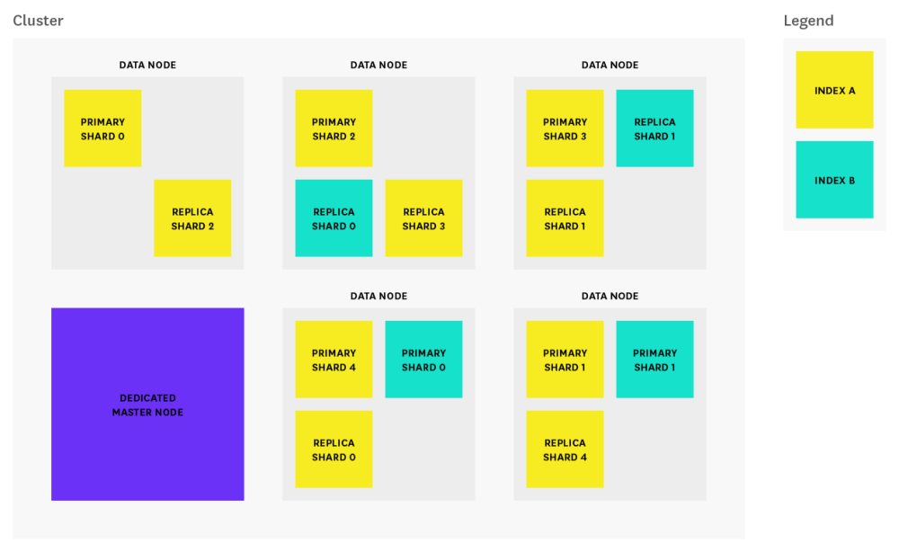
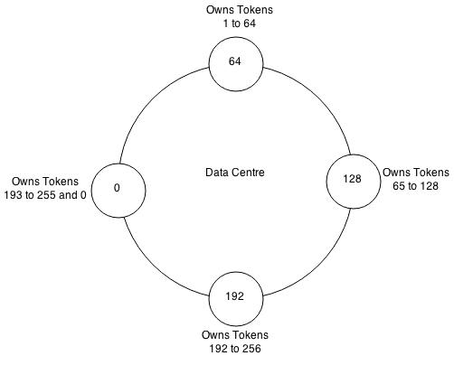
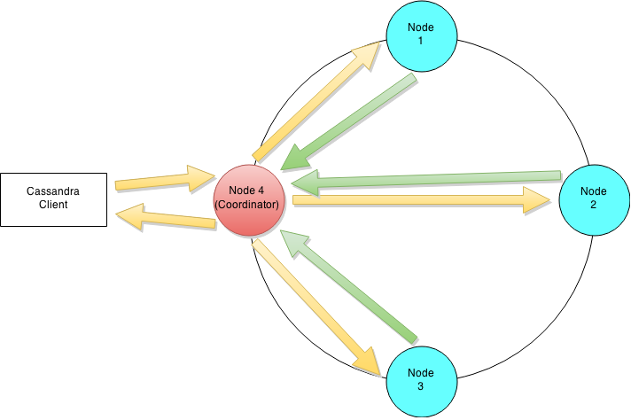
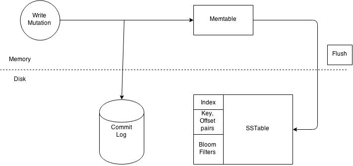

# Zookeeper

- A collection of nodes - servers - that constitute a cluster - ensemble - to create a Distributed system
- A leader is choosen in the ensemble
- Clients connect with a single node of the ensemble
- All nodes of the ensemble can be used to read. Each client uses the node its connected to for reading
- All writes go through the leader

- The servers that make up the ZooKeeper service must all know about each other. They maintain an in-memory image of state, along with a transaction logs and snapshots in a persistent store. As long as a majority of the servers are available, the ZooKeeper service will be available
- The name space provided by ZooKeeper is much like that of a standard file system. A name is a sequence of path elements separated by a slash (/). Every node in ZooKeeper's name space is identified by a path

## Simple API
One of the design goals of ZooKeeper is providing a very simple programming interface. As a result, it supports only these operations:

create : creates a node at a location in the tree

delete : deletes a node

exists : tests if a node exists at a location

get data : reads the data from a node

set data : writes data to a node

get children : retrieves a list of children of a node

Implementation
ZooKeeper Components shows the high-level components of the ZooKeeper service. With the exception of the request processor, each of the servers that make up the ZooKeeper service replicates its own copy of each of the components.

## ZooKeeper Components

The replicated database is an in-memory database containing the entire data tree. Updates are logged to disk for recoverability, and writes are serialized to disk before they are applied to the in-memory database.

Every ZooKeeper server services clients. Clients connect to exactly one server to submit requests. Read requests are serviced from the local replica of each server database. Requests that change the state of the service, write requests, are processed by an agreement protocol.

As part of the agreement protocol all write requests from clients are forwarded to a single server, called the leader. The rest of the ZooKeeper servers, called followers, receive message proposals from the leader and agree upon message delivery. The messaging layer takes care of replacing leaders on failures and syncing followers with leaders.

ZooKeeper uses a custom atomic messaging protocol. Since the messaging layer is atomic, ZooKeeper can guarantee that the local replicas never diverge. When the leader receives a write request, it calculates what the state of the system is when the write is to be applied and transforms this into a transaction that captures this new state.

# Kafka

- A cluster is formed by brokers that consitute a distributed system
- We also have a leader, the __Controller__, that is in charge of keeping the state, knowing which brokers are alive, which partitions are there and selecting the leader for each partition, ...
- Data is kept in Topics
	- Topics are divided in partiticions
	- Partitions are replicated across several brokers - according to the replication factor; Each broker contains a different set of data
	- Each partition has a leader that is picked by the Controller: __Particion Leader__
	- __All reads__ and writes to a Topic Particion are handled by the Partition Leader. The brokers that replicate the data are just used for reliability. When the Particion Leader goes down, the Controller will pick a new Partition Leader
- Consuming data is done with Consumer Groups
	- Each Consumer group elects a leader among the clients conforming it. The first client to connect to Kafka in the Consumer Group will the the Consumer Group Leader
	- The Leader will say which client will read wich partition of the Topic, with the rule that only one client at a time can be consuming from a Partition

# Elasticsearch

A nice description can be seen [here](http://solutionhacker.com/elasticsearch-architecture-overview/).

- An Elasticsearch index is a logical namespace to organize your data (like a database). And the data you put on it is a set of related Documents in JSON format. On top of that, Elasticsearch index also has types (like tables in a database) which allow you to logically partition your data in an index. All documents in a given “type” in an Elasticsearch index have the same properties (like schema for a table).
- An Elasticsearch index has one or more shards (default is 5) that lives in different nodes. The number of primary shards cannot be changed once an index has been created, so choose carefully, or you will likely need to reindex later on.
- Each shard can have zero or more replicas (default is 1). And Elasticsearch makes sure both primary and replica of same shard not colocated in a same node.
- A shard is a Lucene index which actually stores the data and is a search engine in itself.
- A Lucene index is made up of multiple segments and a segment is a fully functional inverted index in itself.
Segments are immutable which allows Lucene to add new documents to the index incrementally without rebuilding the index from scratch.
- For every search request, all the segments in an index are searched, and each segment consumes CPU cycles, file handles and memory. This means that the higher the number of segments, the lower the search performance will be. To get around this problem, __Lucene working behind the scene merges small segments together into a bigger segment__, commits the new merged segment to the disk and deletes the old smaller segments. if not handled carefully it can be computationally very expensive and may cause Elasticsearch to automatically throttle indexing requests to a single thread.
- There are __3 common types of nodes__: __master__, __data__ and __client nodes__.
	- Each cluster automatically elects __a master node__ from all of the master-eligible nodes. The master node is responsible for coordinating cluster tasks like distributing shards across nodes, and creating and deleting indices. 
	- On the other hand, __data node stores data in the form of shards__ and performs actions related to indexing, searching, and aggregating data.
	- Finally, __client node__ that has both node.master and node.data set to false and it acts as load balancer that helps route indexing and search requests. So, it may not be needed for a cluster.
	

## Storage Model

Elasticsearch uses Apache Lucene, a full-text search library written in Java and developed by Doug Cutting (creator of Apache Hadoop), internally which uses a data structure called an inverted index designed to serve low latency search results. A document is the unit of data in Elasticsearch and an inverted index is created by tokenizing the terms in the document, creating a sorted list of all unique terms and associating a list of documents with where the word can be found.

Each record - is called query in Lucene jargon - consists of:

1. Index: equivalent to what a table is in a relational db
2. Type
3. Id
4. Data

## Split Brain

Consensus is one of the fundamental challenges of a distributed system. It requires all the processes/nodes in the system to agree on a given data value/status. There are a lot of consensus algorithms like Raft, Paxos, etc. which are mathematically proven to work, however, Elasticsearch has implemented its own consensus system (zen discovery) 

##Concurrency

__Create, update and delete requests hits primary shard__ that will __in turn send parallel requests to all of its replica shards__. However, it is possible that these request arrive out of order. To resolve it, Elasticsearch uses optimistic concurrency control that uses version number to make sure that newer version of document will not be overwritten by older ones. So, every document indexed has a version number which is incremented with every change applied to that document.

## Consistency
For writes, Elasticsearch supports consistency levels, different from most other databases, to allow a preliminary check to see how many shards are available for the write to be permissible. The available options are:

- quorum: write operation will be permitted if majority of shards are available.
- one: write operation will be permitted if one of shards are available.
- all: write operation will only be permitted if all of shards are available.

__For reads__, new documents are not available for search until after the refresh interval. To make sure that the search request returns results from the latest version of the document, replication can be set to sync (default) which returns the write request after the operation has been completed on both primary and replica shards. In this case, search request __from any shard__ will return results from the latest version of the document.

# Cassandra

See details [here](https://dzone.com/articles/introduction-apache-cassandras).

Cassandra is a peer-to-peer distributed database that runs on a cluster of homogeneous nodes. Cassandra has been architected from the ground up to handle large volumes of data while providing high availability. Cassandra provides high write and read throughput.  A Cassandra cluster has no special nodes i.e. the cluster has no masters, no slaves or elected leaders. This enables Cassandra to be highly available while having no single point of failure.

## Key Concepts, Data Structures and Algorithms

- __Data Partitioning__. Apache Cassandra is a distributed database system using a shared nothing architecture. A single logical database is spread across a cluster of nodes and thus the need to spread data evenly amongst all participating nodes. At a 10000 foot level Cassandra stores data by dividing data evenly around its cluster of nodes. Each node is responsible for part of the data. The act of distributing data across nodes is referred to as data partitioning.
- __Consistent Hashing__. Two main problems crop up when trying to distribute data efficiently. One, determining a node on which a specific piece of data should reside on. Two, minimising data movement __when adding or removing nodes__. Consistent hashing enables us to achieve these goals. A consistent hashing algorithm enables us to map Cassandra row keys to physical nodes. The range of values from a consistent hashing algorithm is a fixed circular space which can be visualised as a ring. Consistent hashing also minimises the key movements when nodes join or leave the cluster. On average only k/n keys need to be remapped where k is the number of keys and n is the number of slots (nodes). This is in stark contrast to most hashing algorithms where a change in the number of slots results in the need to remap a large number of keys.
- __Data Replication__. Partitioning of data on a shared nothing system results in a single point of failure i.e. if one of the nodes goes down part of your data is unavailable. This limitation is overcome by creating copies of the data, know as replicas, thus avoiding a single point of failure. Storing copies of data on multiple nodes is referred to as replication.  Replication of data ensures fault tolerance and reliability.
- __Eventual Consistency__. Since data is replicated across nodes we need to ensure that data is synchronized across replicas. This is referred to as data consistency.  Eventual consistency is a consistency model used in distributed computing. It theoretically guarantees that, provided there are no new updates, all nodes/replicas will eventually return the last updated value.
- __Consistency Level__. Cassandra enables users to configure the number of replicas in a cluster that must acknowledge a read or write operation before considering the operation successful. The consistency level is a required parameter in any read and write operation and determines the exact number of nodes that must successfully complete the operation before considering the operation successful.
- __Data Centre, Racks, Nodes__. Cassandra can be easily configured to work in a multi DC environment to facilitate fail over and disaster recovery.
- __Gossip Protocol__. Cassandra uses a gossip protocol to discover node state for all nodes in a cluster.  Nodes discover information about other nodes by exchanging state information about themselves and other nodes they know about. __This is done with a maximum of 3 other nodes__. Nodes do not exchange information with every other node in the cluster __in order to reduce network load__. They just exchange information with a few nodes and over a period of time state information about every node propagates throughout the cluster. The gossip protocol facilitates failure detection.
- __Cassandra Keyspace__. Keyspace is __similar to a schema in the RDBMS world__. A keyspace is a __container for all your application data__. When defining a keyspace, __you need to specify a replication strategy and a replication factor__ i.e. the number of nodes that the data must be replicate too.
- __Column Family__. A column family is __analogous to the concept of a table in an RDBMS__. But that is where the similarity ends. Instead of thinking of a column family as RDBMS table think of a column family as a __map of sorted map__. A row in the map provides access to a set of columns which is represented by a sorted map.  __Map<RowKey, SortedMap<ColumnKey, ColumnValue>> Please note in CQL (Cassandra Query Language) lingo a Column Family is referred to as a table__.
- __Row Key__. A row key is __also known as the partition key__ and has a number of columns associated with it i.e. a sorted map as shown above. The row key is responsible for determining data distribution across a cluster.

## Cassandra Cluster/Ring

Every Cassandra cluster must be assigned a name. All nodes participating in a cluster have the same name. __Seed nodes__ are used during start up to help __discover all participating nodes__. Seeds nodes __have no special purpose other than helping bootstrap the cluster__ using the __gossip protocol__.

When a node starts up it looks to its seed list to obtain information about the other nodes in the cluster. Cassandra uses the gossip protocol for intra cluster communication and failure detection. 

A node __exchanges state information with a maximum of three other nodes__. State information is exchanged every second and contains information about itself and all other known nodes.  This enables each node to learn about every other node in the cluster even though it is communicating with a small subset of nodes.

__A Cassandra cluster is visualised as a ring because it uses a consistent hashing algorithm to distribute data__. 

1. At start up each node is assigned a token range which determines its position in the cluster and the rage of data stored by the node. 
2. Each node receives a proportionate range of the token ranges to ensure that data is spread evenly across the ring. 

The figure above illustrates dividing a 0 to 255 token range evenly amongst a four node cluster. Each node is assigned a token and is responsible for token values from the previous token (exclusive) to the node's token (inclusive). 

### Partitioner

__Each node in a Cassandra cluster is responsible for a certain set of data which is determined by the partitioner__. 

A __partitioner is a hash function__ for __computing the resultant token__ for a particular row key. __This token__ is then __used to determine the node__ which will store __the first replica__.  Currently Cassandra offers a Murmur3Partitioner (default), RandomPartitioner and a ByteOrderedPartitioner.

## Replication

Cassandra also replicates data according to the chosen replication strategy. The __replication strategy determines placement of the replicated data__.  There are two main replication strategies used by Cassandra:

- Simple Strategy
- Network Topology Strategy

1. The first replica for the data is determined by the partitioner. 
2. The placement of the subsequent replicas is determined by the replication strategy
	- The simple strategy places the subsequent replicas on the next node in a clockwise manner
	- The network topology strategy works well when Cassandra is deployed across data centres. The  network topology strategy is data centre aware and makes sure that replicas are not stored on the same rack
	
## Cassandra Write

Let's assume that a client wishes to write a piece of data to the database.

Cluster level interaction for a write and read operation.

Since Cassandra is masterless __a client can connect with any node in a cluster__. Clients can interface with a Cassandra node using either a thrift protocol or using CQL. 

1. In the picture bellow the client has connected to Node 4. The node that a client connects to is designated as the __coordinator__, also illustrated in the diagram. 
2. The coordinators is responsible for satisfying the clients request. The __consistency level__ determines the __number of nodes that the coordinator needs to hear from__ in order to notify the client of a successful mutation.  
3. All __inter-node requests__ are sent through a __messaging service and in an asynchronous manner__. Based on the partition key and the replication strategy used the coordinator __forwards the write to all applicable nodes__. In our example it is assumed that nodes 1,2 and 3 are the applicable nodes where node 1 is the first replica and nodes two and three are subsequent replicas.
4. The coordinator __will wait for a response from the appropriate number of nodes__ required to satisfy the consistency level.  __QUORUM__ is a commonly used consistency level which refers to a majority of the nodes. QUORUM can be calculated using the formula (n/2 +1) where n is the replication factor. In our example let's assume that we have a consistency level of QUORUM and a replication factor of three. Thus the coordinator will wait for at most 10 seconds (default setting) to hear from at least two nodes before informing the client of a successful mutation.

### Write operations at a node level

Each node processes the request individually. Every node __first writes the mutation to the commit log__ and __then__ writes the mutation __to the memtable__. Writing to the commit log __ensures durability__ of the write as the memtable is an in-memory structure and is only written to disk when the memtable is flushed to disk. 

A memtable is flushed to disk when:

- It reaches its maximum allocated size in memory
- The number of minutes a memtable can stay in memory elapses.
- Manually flushed by a user

A memtable is flushed to an immutable structure called and SSTable (Sorted String Table). __The commit log is used for playback purposes in case data from the memtable is lost due to node failure__. For example the machine has a power outage before the memtable could get flushed. 

Every SSTable creates three files on disk which include a bloom filter, a key index and a data file. Over a period of time a number of SSTables are created. This results in the need to read multiple SSTables to satisfy a read request. Compaction is the process of combining SSTables so that related data can be found in a single SSTable. This helps with making reads much faster.

## Cassandra Read

At the cluster level a read operation is similar to a write operation. As with the write path the __client can connect with any node__ in the cluster. The chosen node is called the __coordinator__ and is __responsible for returning the requested data__.  

A __row key must be supplied__ for every read operation. The __coordinator uses the row key__ to determine the __first replica__. The __replication strategy in conjunction with the replication factor is used to determine all other applicable replicas__. 

As with the write path __the consistency level determines the number of replica's that must respond before successfully returning data__. Let's assume that the request has a consistency level of QUORUM and a replication factor of three, thus requiring the coordinator to wait for successful replies from at least two nodes. 

__If the contacted replicas has a different version of the data__ the __coordinator returns the latest version to the client__ and __issues a read repair command__ to the __node/nodes__ with the older version of the data. The read repair operation pushes the newer version of the data to nodes with the older version.